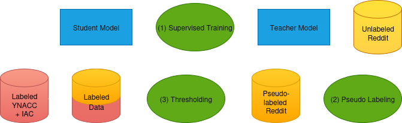

# Reddit Constructiveness Classification

A comprehensive machine learning pipeline for training and evaluating models to classify constructive vs. non-constructive discussions in Reddit threads. This project combines data processing, statistical analysis, and advanced training techniques including self-training and Mean Teacher approaches.

## Project Overview

This repository implements a complete workflow for:
- Processing Reddit data (posts and comments) from large-scale datasets
- Creating structured databases and statistical analyses
- Training transformer models for constructiveness classification
- Evaluating model performance with comprehensive metrics and visualizations

The project supports multiple model architectures (ModernBERT, Qwen) and training approaches (supervised, semi-supervised) with flexible configuration options.

## Training Process

The project implements a comprehensive self-training approach for constructiveness classification. The training workflow is visualized in the following diagram:

<div align="center">
  
  <br><br/>
</div>

Self-training setup diagram showing one iteration of the iterative training process. The process begins with (1) supervised training of a student model using only labeled YNACC and IAC data (red). This trained student model then becomes the teacher model, which performs (2) pseudo-labeling by generating predictions on unlabeled Reddit data (yellow). These pseudo-labels undergo (3) confidence-based thresholding to filter out low-confidence predictions, resulting in high-confidence pseudo-labeled Reddit data (orange). The filtered pseudo-labeled Reddit data is then combined with the original labeled YNACC and IAC data to create an expanded training set for the next iteration. A new student model is initialized and trained on this combined dataset, and the cycle repeats. With each iteration, confidence thresholds are gradually lowered to include more pseudo-labeled samples, continuing until the process converges or reaches a predetermined minimum threshold.

## Repository Structure

### Data Processing
- **`explore_data.ipynb`**: Initial exploration of RS_2020-05 and RC_2020-05 datasets
- **`create_df.ipynb`**: Extract metadata from raw Reddit data → `posts.csv`, `comments.csv`
- **`filter_df.ipynb`**: Exploratory analysis for database creation
- **`create_database.py`**: Build DuckDB database with thread tables → `database_subset10.db`
- **`get_samples.py`**: Generate random samples from the database
- **`display_thread.py`**: Render Reddit threads in readable format

### Statistical Analysis
- **`stats.py`**: Generate comprehensive dataset statistics → `saved_stats.json`
- **`plots.py`**: Create statistical visualizations → `plots_full_data/`, `plots_training_data/`, `plots_constructive_training_data/`
- **`analyze_reddit_subreddit_stats.py`**: Subreddit-level analysis → `reddit_subreddit_statistics.json`

### Model Training and Evaluation
- **`training_preparations.ipynb`**: Prepare YNACC, IAC, and Reddit datasets for training → `ynacc_processed.jsonl`, `iac_processed.jsonl`, `reddit_train.jsonl`, `reddit_val.jsonl`, `reddit_test.jsonl`
- **`train_classifier.py`**: Core training script with multiple modes and configurations
- **`classifier_config_hpc.py`**: Configuration management for training parameters

#### Training Configurations
The `train_classifier.py` supports various training modes through configuration flags:

**General Settings:**
- `qwen: True` → Use Qwen3-Embedding-0.6B model
- `qwen: False` → Use ModernBERT-base model
- `USE_QLORA: True` → QLoRA fine-tuning for quantized models

**Training Approaches:**
- `USE_MEAN_TEACHER: True` → Mean Teacher semi-supervised learning
- `SUPERVISED_TRAINING_ONLY: True` → Initial training on labeled data only

**Operational Modes:**
- **Training Mode**: Standard model training with checkpoint saving
- **Testing Mode** (`TESTING_MODE_ONLY: True`): Evaluate all checkpoints → `checkpoint_test_results_*.json`
- **Annotation Mode** (`CORPUS_ANNOTATION_MODE: True`): Generate predictions for unlabeled data → `reddit_train_annotated.jsonl`
- **Prompting Mode** (`USE_LANGUAGE_MODEL: True`): Use language models for classification → `qwen_*_inst_*/`

### Results Analysis and Visualization
- **`parse_slurm_metrics.py`**: Extract metrics from SLURM output files → `performance_metrics_*.json`
- **`visualize_performance_metrics.py`**: Create training performance plots → `training_plots_*/`
- **`visualize_checkpoint_results.py`**: Generate confusion matrices → `visualizations_*/`
- **`results_processing.ipynb`**: Analyze model results and label correlations

## Installation

1. **Clone the repository:**
   ```bash
   git clone https://github.com/Niklas257/Reddit-Constructiveness-Classification.git
   cd reddit_project
   ```

2. **Install dependencies:**
   ```bash
   pip install -r requirements.txt
   ```

3. **Set up data directory:**
   Ensure you have access to Reddit datasets (e.g. RS_2020-05, RC_2020-05) and place them in the `data/` directory.

## Usage

### 1. Data Preparation
```bash
# Create database from raw Reddit data
python python_files/create_database.py

# Generate statistical analysis
python python_files/stats.py
python python_files/plots.py
```

### 2. Dataset Preparation for Training
Run `training_preparations.ipynb` to prepare datasets for model training.

### 3.1 Model Training
```bash
# Configure training parameters in classifier_config_hpc.py
# Then run training
python python_files/train_classifier.py
```

### 3.2 Annotation with Trained Model
```bash
# Set CORPUS_ANNOTATION_MODE = True in config, then run
python python_files/train_classifier.py
```
### 3.3 Annotation with Language Model
```bash
# Set USE_LANGUAGE_MODEL = True in config, then run
python python_files/train_classifier.py
```

## Key Features

- **Multi-model Support**: ModernBERT and Qwen transformer architectures
- **Advanced Training**: Self-training, Mean Teacher, and QLoRA techniques
- **Comprehensive Evaluation**: Detailed metrics, confusion matrices, and performance plots
- **Flexible Configuration**: Easy parameter adjustment through config files
- **HPC Compatibility**: SLURM integration for high-performance computing environments. Automatically detects the available GPUs and runs multi-gpu training if possible.

## Output Files

- **Models**: Trained checkpoints saved in `training_data/` subdirectories
- **Metrics**: Performance data in JSON format
- **Visualizations**: Plots and confusion matrices in designated output folders
- **Annotations**: Predicted labels for unlabeled corpora

## Requirements

- Python 3.12.3
- CUDA-compatible GPU for model training
- Sufficient storage for Reddit datasets and model checkpoints

See `requirements.txt` for detailed package dependencies.
